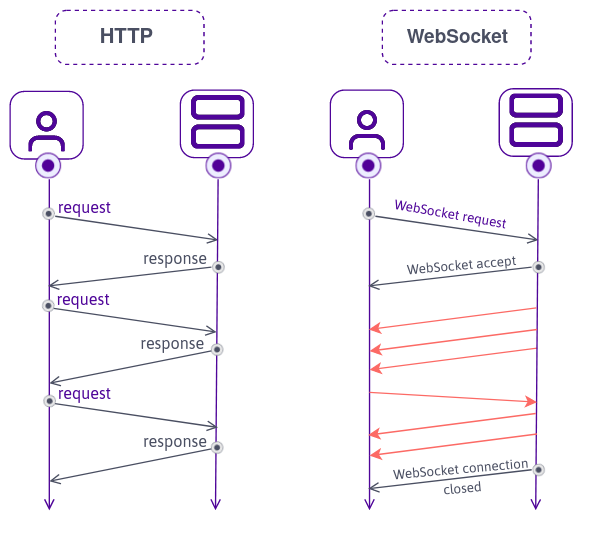

# 1.1 HTTP vs WebSocket

### HTTP
: 인터넷 프로토콜
- <b>stateless</b>: request에 대한 response를 주고난 후면 backend는 client를 기억하지 못하고 끝난다.

### WebSocket
: 실시간 프로토콜 ex) chat, notification
- request에 한번 accept 하게되면 client와 서버는 계속 통신 가능하다.



<br><br>

# 1.2 WebSockets in NodeJS

### ws 설치
: core한 webSocket 패키지 (향후 프레임워크 사용하기 전 기본을 알기 위해)
- github.com/websockets/ws
```
npm i ws
```

<br><br>

# 1.3 WebSocket Events

### server.js의 socket의 의미: 연결된 브라우저
```
function handleConnection(socket) {
    console.log(socket);
}

wss.on("connection", handleConnection);
```

### app.js의 socket의 의미: 서버로의 연결
```
const socket = new WebSocket(`ws://${window.location.host}`);
```

<br><br>

# 1.4 서버 <-> 프론트 양방향 통신

front와 back에서 이벤트 함수는 비슷하다.

### server.js
- 브라우저를 종료할 때 실행
```
socket.on("close", () => console.log("disconnected from Browser"));
```

- 브라우저에서 보낸 메시지
```
socket.on("message", (message) => {
    console.log(message.toString());
});
```

- 브라우저에 보내는 메시지
```
socket.send("hello hi");
```

### app.js

- 서버가 시작될 때 실행
```
socket.addEventListener("open", () => {
    console.log("connected to Server");
});
```

- 서버에서 보낸 메시지
```
socket.addEventListener("message", (message) => {
    console.log("got from th server: ", message.data);
});
```

- 서버를 종료할 때 실행됨
```
socket.addEventListener("close", () => {
    console.log("disconnected from Server");
});

```

- 서버에 보내는 메시지
```
socket.send("hello from the browser!");
```

<br><br>