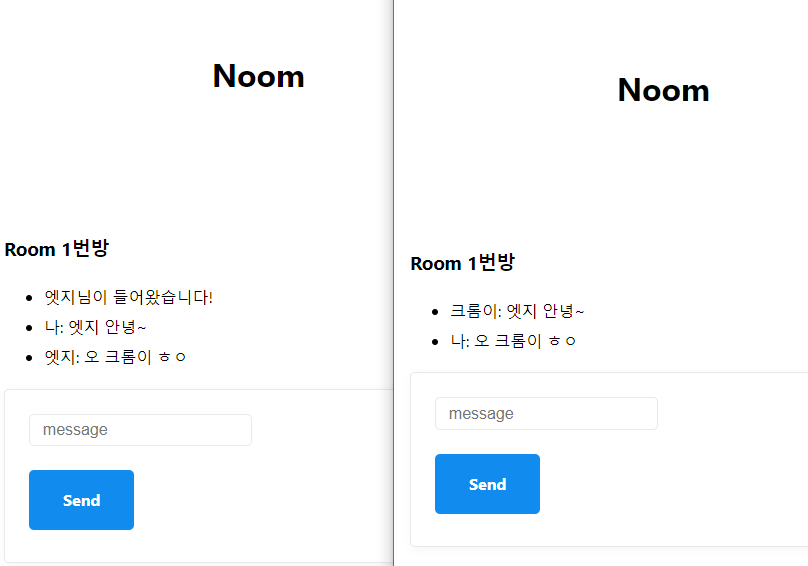

# 2.0 WebSockets vs SocketIO

## [SocketIO](https://socket.io/)
: 실시간, 양방향, event 기반의 통신을 가능하게하는 프레임워크
- WebSocket을 사용한다. WebSocket 연결이 불가능한 경우 HTTP long polling을 사용한다.
- 자동 재연결 ex) wifi가 끊겨도 재연결한다.
- Server API, Client API 별도로 존재한다.
- 카지노 사이트에서 많이 사용된다.

<br><br>

# 2.1 SocketIO 설치 후 연결하기

### SocketIO 설치하기
```
npm i socket.io
```

### 브라우저에 SocketIO 설치되어 있어서 back-end Socket.io와 연결해서 사용 가능하다.
```
script(src="/socket.io/socket.io.js")
```

### http 위에 소켓서버 띄우기
```
const httpServer = http.createServer(app);
const wsServer = SocketIO(httpServer);
```

### front 소켓과 연결하기
```
wsServer.on("connection", socket => {
    console.log(socket);
});
```

<br><br>

# 2.2~2.3 SocketIO - 서버 ⇄ 프론트 양방향 통신

> Socket IO를 이용하면 방에 참가하고  떠나는 것이 매우 간단하다.

### WebSockets
- message라는 이벤트로, 파라미터는 string으로만 전송했어햐 했다. (object의 경우 string으로 변환해야함)

👇👇👇

### SocketIO
- 1. 특정한 이벤트를 emit (=send) 해줄 수 있다.
- 2. object, numbrt, boolean 타입도 파라미터로 전송할 수 있다.
```
socket.emit("enter_room", {payload: input.value}, 5);
```

### 끝날 때 실행되는 function을 보내고 싶으면 꼭 emit함수의 마지막 파라미터로 넣어야 한다.

app.js
```
socket.emit("enter_room", {payload: input.value}, (msg) => {
    console.log(`The Server says: `, msg);
});
```

server.js
> 프론트엔드에서 구현한 함수가 백에서 실행되는게 아니라, 프론트에서 실행되는 것이다.
```
socket.on("enter_room", (roomName, done) => {
    console.log(roomName);
    done("server is done!"); // 해당 코드가 실행되면 프론트엔드에서 구현한 함수가 프론트에서 실행된다
});
```

<br><br>

# 2.4 Rooms

### 소켓을 주어진 방에 추가하기
```
socket.join(roomName);
```

### 이벤트 리스너
```
socket.onAny((event) => {
    console.log(`Socket Event:${event}`);
})
```

### 기본적으로 User와 서버 사이에 private room이 있다 (socket.id)
```
console.log(socket.rooms);
```

<br><br>

# 2.5~2.6 Room Messages 주고 받기

### room에 있는 모든 socket으로 메시지 보내기 (서버👉클라이언트)
- 본인 socket은 제외하고 보내진다.

server.js
```
socket.on("enter_room", (roomName, done) => {
    socket.join(roomName);

    // 본인 소켓 외의 모든 room에 메시지 보내기
    socket.to(roomName).emit("welcome");
});

socket.on("disconnecting", () => {
    socket.rooms.forEach((room) => {
        socket.to(room).emit("bye");
    });
})
```

app.js
```
socket.on("welcome", () => {
    addMessage("누군가 들어왔습니다!");
})

socket.on("bye", () => {
    addMessage("누군가 나갔습니다!");
})
```

<br><br>

# 2.7 Nicknames

### 닉네임 값 입력받기 (클라이언트👉서버)

app.js
```
socket.emit("nickname", input.value);
```

server.js
```
socket.on("nickname", (nick) => {
    socket["nickname"] = nick;
});
```

## 두 브라우저간의 통신 결과화면


<br><br>

# 2.8~2.9 Room Count

## Adapter
: 다른 서버들 사이에 실시간 어플리케이션을 동기화하는 역할
ex) 만약 A서버에 있는 클라이언트가 B서버에 있는 클라이언트에 메시지를 보내고 싶어도 각각 서버는 다른 메모리를 사용하고 있기 때문에 불가능하다.
👉 해결방법은 Adapter를 사용하는 것 이다.

### [MongoDB Adapter](https://socket.io/docs/v4/mongo-adapter/)
: Adapter는 MongoDB를 사용해서 서버간의 통신을 해준다.
ex) 만약 A서버에 있는 클라이언트가 B서버에 있는 클라이언트에 메시지를 보낼 때 A서버 -> Adapter -> MongoDB -> Adapter -> B서버 를 통해 통신이 가능 하다.


### socket id들을 가져와서 public room과 private room을 구분하기
- wsServer.sockets.adapter.sids: socket id 목록
- wsServer.sockets.adapter.rooms: room id 목록
```
const {
    socket: {
        adapter: {sids, rooms}, 
    }, 
} = wsServer;

rooms.forEach((_, key) => {
    // socket id와 동일하지 않는 room id이면 채팅방이다.
    if(sids.get(key) === undefined) {
        publicRooms.push(key);
    }
});
```

### 모든 소켓에 메시지 보내기
```
wsServer.sockets.emit("room_change", publicRooms());
```

<br><br>

# 2.10 User Count

### room 안의 참여자 수
```
wsServer.sockets.adapter.rooms.get(roomName)?.size;
```

<br><br>

# 2.11 Admin Panel

## [Admin UI](https://socket.io/docs/v4/admin-ui/)
: 현재 연결된 서버 및 클라이언트, 각 방의 세부 사항 등 관리가능한 어드민 페이지

### admin-ui 설치하기
- [대시보드 확인하기](http://localhost:4000/admin)
```
npm i @socket.io/admin-ui
```